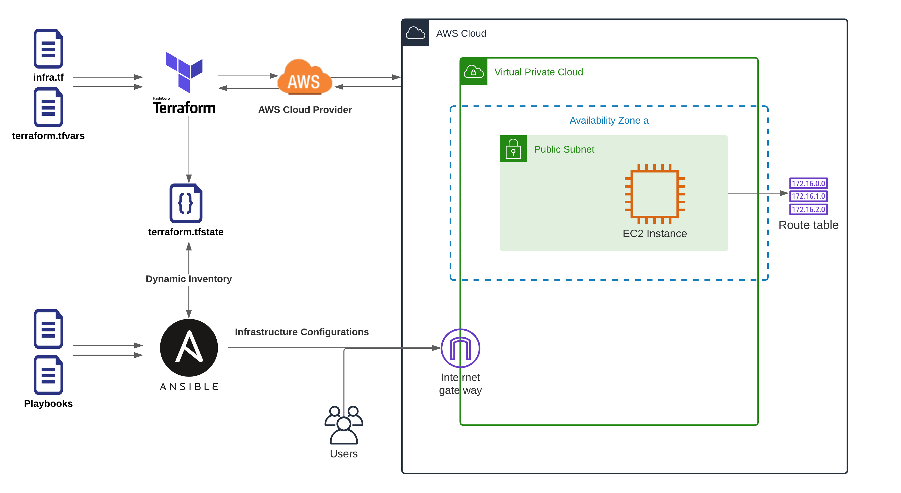
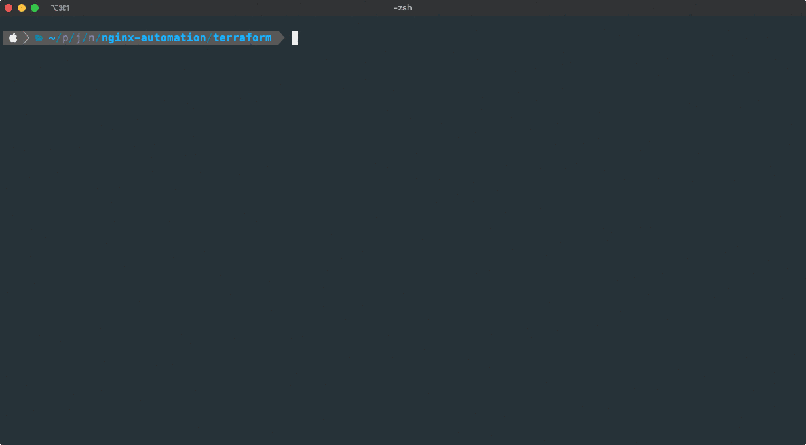

# Nginx deployment automation with Terraform and Ansible in AWS.

In this project, we create an EC2 instance and other required networking resources in the AWS cloud. Instance IP address required by Ansible to configuring the service will be store in the `inventory` file in the `ansible` directory by Terraform, in the last step ansible-playbook triggered to start the service configuration process.

Ansible provides two installation method, from APT package management and public Nginx GIT repository. It's possible to configure the installation method both from Ansible and Terraform CLI command (`package` and `git` as value).

## Diagram


## Let's go!
First Install [Ansible](https://docs.ansible.com/ansible/latest/installation_guide/intro_installation.html#) and [Terraform](https://learn.hashicorp.com/tutorials/terraform/install-cli) CLI on your system.

Clone the repository.
 
```
git clone https://github.com/irajtaghlidi/nginx-automation.git
```

Now change directory to the Terraform location.
 
```
cd nginx-automation/terraform
```

## Configuration
### Infrastructure
Terraform automatically read `terraform.tfvars` file to use variables inside it, So rename the `terraform.tfvars.example` template file to `terraform.tfvars` and open it with a text editor.

```
cp terraform.tfvars.example terraform.tfvars && vim terraform.tfvars
```


Here we should configure our AWS API keys, and select a valid public and private key, these keys will be used for the EC2 Key-pair resource and Ansible. Also, we can customize the desired region and other variables like VPC and subnet IP ranges in this file.

Suggestion: Create a new IAM user with limited permissions and create an access key for it.
 
 ### Nginx Service
 Nginx package version and GIT revision/commit hash value are configurable in Nginx Role variable file located at `ansible/roles/nginx/vars/main.yml` from the root directory.
 
 ```
 vim ../ansible/roles/nginx/vars/main.yml
 ``` 
 
 ## Create Infrastructure and Configure service
 First, we need to initialize Terraform to download the required module and provider files.
 
 ```
 terraform init
 ```
 
 To start creating infrastructures run these commands in `terraform` directory.
 
 ```
 terraform plan
 ```
 
 ```
 terraform apply
 ```
 
 After performing the last step, the server IP address is stored in an `inventory` file in `ansible` root directory and trigger `ansible-playbook` to execute all configuration to set up the Nginx service.


## Choose the installation method

The installation method of Nignx can be set with `installation_method` variable inside `terraform.tfvars` file. It can be overwritten via Command Line at run-time also.

For example to set GIT as installation method:

```
terraform apply -var="installation_method=git"
```

** Terraform pass this variable to `ansible-playbook` via command-line variable like: `-e="method=git"`.

## Preview



### Test
Ansible has a declarative strategy so when it shows its task results in green text with final stats with no errors, so it means everything is working as expected. But we can run a separate playbook to check each step with a different method to ensure everything is working.

From root of repository:

```
cd ansible
```

```
ansible-playbook -e="method=git" test.yml
```


### Directory structure

```
├── README.md
├── ansible
│   ├── ansible.cfg
│   ├── inventory
│   ├── main.yml
│   ├── roles
│   │   ├── base
│   │   │   └── tasks
│   │   │       └── main.yml
│   │   └── nginx
│   │       ├── files
│   │       │   ├── default.sites
│   │       │   ├── nginx.conf
│   │       │   └── nginx.service
│   │       ├── tasks
│   │       │   ├── main.yml
│   │       │   ├── method_git.yml
│   │       │   └── method_package.yml
│   │       └── vars
│   │           └── main.yml
│   └── test.yml
└── terraform
    ├── infra.tf
    ├── terraform.tfstate
    ├── terraform.tfstate.backup
    ├── terraform.tfvars
    ├── terraform.tfvars.example
    └── variables.tf
```

## Final

The final URL is returned by `terraform apply` command, so we just open it in the browser.

Did you see the custom header in the response packet? ;)
